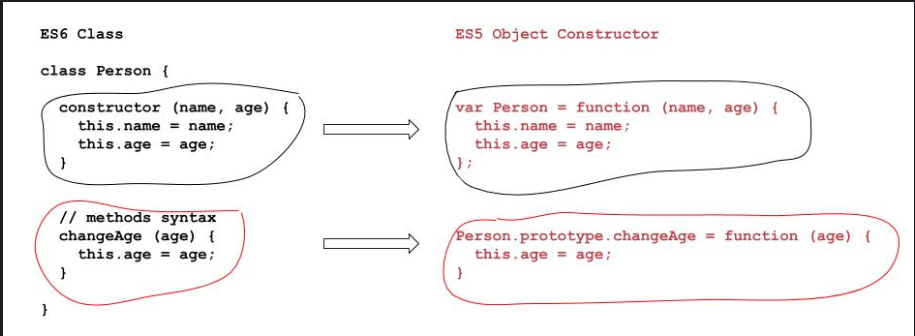
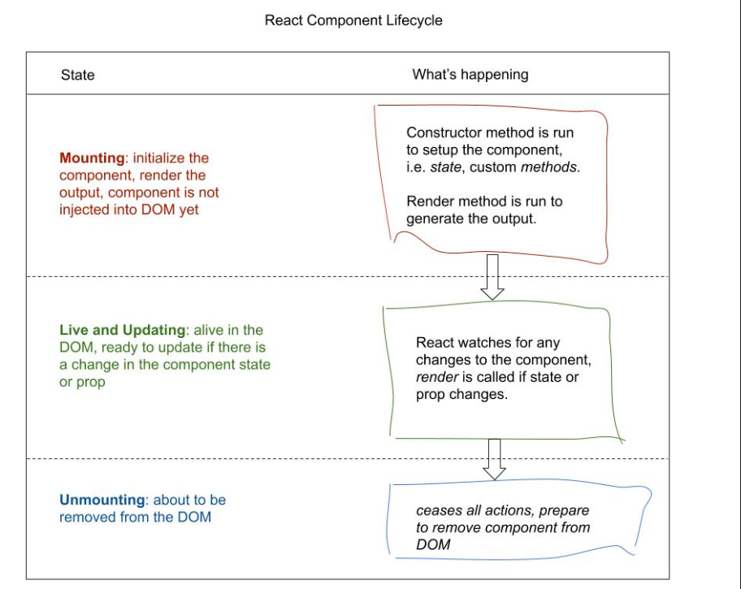
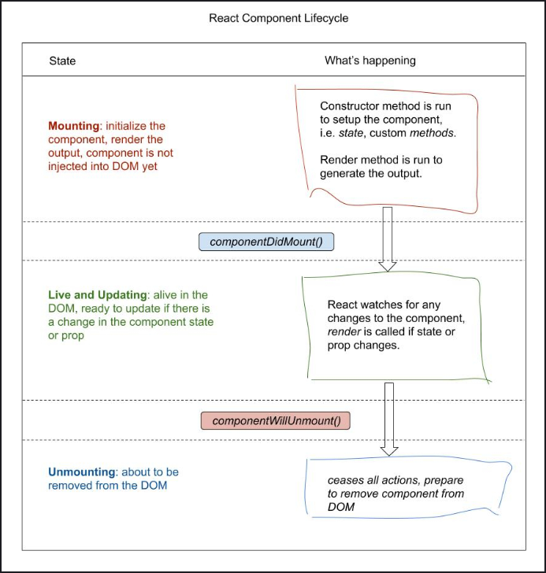

# Basic react

### How to install

**1. Create react app through npm**
```
npx create-react-app my-app
cd m-app
npm install
npm start
```

**2.Adding React libraries to the head of HTML through CDNS**

---

## React example

1. React accepts 3 inputs: type, props and children. 

- type: tag name ("div","span","h1")
- props: an object properties
- children: child elements you to be nested inside the element

2. ReactDOM.render accepts two inputs: react element and container reference to inject the element


```
const element = React.createElement(
  'h1', //type
  {className: 'title'}, //props
  'Hello World!' //children
);

ReactDOM.render(
  element,
  document.getElementById('root') // Container DOM node
);
```

### Using same component in multiple places

```
ReactDOM.render(
  element,
  document.getElementById('root2')
);
```

---

## React JSX

- Jsx is developed to write react elements faster

```
const element = React.createElement(
  'h1',
  {},
  'Hello World!'
);
```

change to

```
const element = <h1>Helo World!</h1>;
```

- Browsers arenot cable of understanding JSX -> add following tag to your HTML head element

```
<script src="https://unpkg.com/babel-standalone@6/babel.min.js"></script>
```

- And add type attribute so compiler knows it needs to be translated

```
<script type="text/babel" src="script.js"></script>
```

### Styling

- className replaces class

- To write inline styles, we use {{}} 

```
 return (
    <h1
      className="greeting"
      style={{ color: 'yellow' }}
    >
    Hello my friend
    </h1>
  );
```

### Custom components

- A custom component is a JS function that accepts inputs ( props in React terminology) and return a user interface output using JSX.

- The attribute degree={25} is passed to the Temperature function under the props object

```
const Temperature = (props) => {
  return <h1>The current temperature is {props.degree}</h1>;
}

const elementRender = <Temperature degree={25} /> //<Temperature is a custom component

```

- Impure function will not  be allowed as a React component
```
const add = (total, value) => {
  total += value;
}; //example of impure function
```

## Adding State to a component

- To update current time, we can use date method or setInterval

- But there is better way to do this: ES6 Class

### Class

- The language's attempt to make JS more similar to traditional OOP (object Oriented Programming)
- ES6 class is another way to write JS prototype based Object Constructors
- Object Constructor: an object wrapper for the given value.
   
     ES6                                             
    
```                                                     
class Person {                                        
  constructor(name,age) {                            
    this.name = name;                                 
    this.age =age;
  }

  // methods syntax
  changeAge (age) {
    this.age = age;
  }
}

const tom = new Person('Tom', 20);
tom.changeAge(21);
console.log(tom.age);
// -> 21

```

ES5
```
var Person = function (name, age) {
  this.name = name;
  this.age = age;
};

Person.prototype.changeAge = function (age) {
  this.age = age;
}

const tom = new Person('Tom', 20);
tom.changeAge(21);
console.log(tom.age);
// -> 21
```


### ES6 class inheritance
- Inheritance allows one object to constructor to copy over the properties and methods of another object constructor

```
  class Student extends Person {
    constructor(name, age, subject) {
         super(name, age); 
         this.subject = subject;
    }
  
  changeSubject (subject) {
    this.subject = subject;
  }
}

var mary = new Student('Mary', 21, 'Physics');
mary.changeAge(22);
mary.changeSubject('Astrophysics');
```

- ES6 and ES5 do the same thing, but ES6 reduces the complexity


### State of class component

- React Class components use a specific object property called state to act as a storage system for each component instance. This is like using a variable to store values, except it is contained within an object and won't pollute the global scope.

- For example below, clock custom component inherits all properties and mthods from React.component

- A React Class component needs to have a render method that returns an output

- props now is an Object property in render()

```
class Clock extends React.Component {
  constructor(props) {
    super(props);
    this.state = {
      date: new Date(),
      location: "New York",
    }; 
  }

  //{location, date} replaces this.state
  render() {
    const { location, date } = this.state;
    return (
      <div>
        <h2>
          The time now is {date.toLocaleTimeString()} in {location}.
        </h2>
      </div>
    );
  }
}

ReactDOM.render(<Clock />, document.getElementById("root7"));
```

## React component lifecycle

- In React, we are not the one responsible for updating the DOM. We just write the logic and the output, and React takes care of injecting the content into the DOM. -> React has a process that manages the lifecycle of a component

- A React component can exist in one of three states:

#### **1. Mounting** : component is not yet mounted into the DOM,  the constructor method is invoked to execute any code we have written in it, usually for initilizing the state. Then the render method is run to get an output from the component.

#### **2. Live(and updating)**: after the component is injected into the DOM "mounted", React will watch for any changes in the component, and update the component in the DOM to its newest state when changes happen.

#### **3. Unmounting**: nothing much really happens in this state, the component is about to be removed from the DOM. A scenario of when a React component unmounts could be if we created a notification component, and the user dismisses a notification.



### Doing things between state change ( lifecycle methods)

#### There are 2 methods that REACT has so we can use after a component has mounted and just before a component unmounts ( in case we need to do any cleanups)

    - componentDidMount: this is run right after a component has mounted and goes to the live state
    - componentWillUnmount: this is run right before a component unmounts. A component unmounts when it is no longer needed on the page, this could be due to a page change, the user closes the browser tab or window, or the component is dismissed by the user, such as a notification component.



## Things to know about state

### You shall not modify state directly

- The only way to update state is via the setState() method

```
// Wrong, will not work, DOM output won't update
this.state.date = new Date();

```

```
// Correct
this.setState({ date: new Date() });
```

### Initialize state in constructor

- We should initialize this.state in the constructor method only.

```
constructor (props) {
  super(props);
  this.state = { date: new Date() };
}
```

### State can be passed down


```
const DateDisplay = (props) => {
  return <h2>The time now is {props.date.toLocaleTimeString()}.</h2>
}

render () {
  return (
    <div>
      <DateDisplay date={this.state.date} />
    </div>
  )
}
```

- DateDisplay wouldn't know whether the date prop came from a state or was manually typed. It doesn't care either, as long as the date value is valid.

### Component instances and their states are independent


## Event Handling

#### Events in React JSX is very similar to HTML. 2 syntax differences:
 
- JSX event names are in camelCase, rather than lowercase.

- In JSX, a function value is passed to the event handler attribute, rather than a string.
